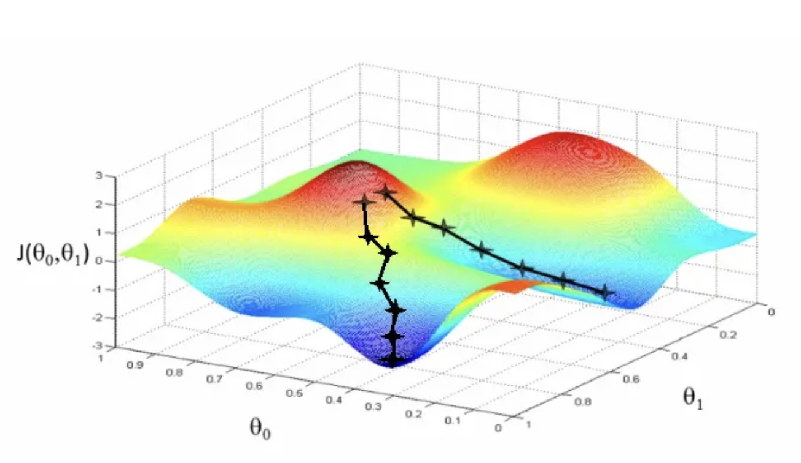

# Gradient Descent: The Heartbeat of Machine Learning

> _"In order to learn, one must first descend."_ — Anonymous

This module in the **Foundations** series explores one of the most fundamental optimization algorithms in all of machine learning — **Gradient Descent**.
Every neural network trained, every regression line fitted, and every modern transformer fine-tuned rests upon this elegant idea:

> _Move a little in the direction that reduces your error._

By implementing **Batch Gradient Descent**, **Stochastic Gradient Descent (SGD)**, and **Mini-Batch Gradient Descent** from scratch, we uncover not only how optimization works, but also _why_ it works — and what tradeoffs emerge when we move from theory to practice.

---

## The Philosophy of Gradient Descent

At its core, gradient descent is nothing more than an iterative process of **improvement**.
Imagine you are standing on a foggy mountain, trying to reach the lowest point of the valley. You can’t see far, but you can feel the slope beneath your feet.
At each step, you move slightly **downhill**, following the gradient of the surface — the direction of steepest descent.

This is exactly what gradient descent does for machine learning models.

- The **mountain** represents the **loss function** (how wrong your model is).
- The **coordinates** are the **model parameters** (weights and biases).
- The **slope** is the **gradient**, computed through calculus.

By following the negative gradient step by step, we gradually find parameters that minimize the loss — improving the model’s predictions.

---

## Mathematical Intuition

For a loss function $J(\theta)$, where $\theta$ represents model parameters:

$$
\theta := \theta - \alpha \nabla_\theta J(\theta)
$$

where:

- $\nabla_\theta J(\theta)$ — gradient (vector of partial derivatives)
- $\alpha$ — learning rate (step size)
- $\theta$ — parameters being optimized

This single equation drives almost all learning in modern AI.

---

## Implementations Included

### 1. **Batch Gradient Descent**

**Philosophy:** Learn from the entire dataset before making a single update.

- Uses all samples to compute the exact gradient.
- Guarantees convergence to the global minimum (for convex functions).
- Computationally expensive for large datasets.

**Update rule:**

$$
\theta := \theta - \alpha \frac{1}{N} \sum_{i=1}^N \nabla_\theta J_i(\theta)
$$

**Pros:**

- Smooth, stable convergence
- Deterministic (same result every time)

**Cons:**

- Slow on large datasets
- Memory-intensive (must load all data)

---

### 2. **Stochastic Gradient Descent (SGD)**

**Philosophy:** Learn from one example at a time — the purest form of learning by experience.

- Uses only one random data point per update.
- Extremely fast, enables online learning.
- Adds noise to the optimization path — can help escape local minima.

**Update rule:**

$$
\theta := \theta - \alpha \nabla_\theta J_i(\theta)
$$

**Pros:**

- Fast updates (ideal for streaming or large-scale data)
- Helps generalization by adding stochasticity

**Cons:**

- Noisy convergence
- Requires careful learning rate tuning

---

### 3. **Mini-Batch Gradient Descent**

**Philosophy:** Balance between stability and speed.

- Divides data into small “mini-batches” of size $m$ (e.g., 32, 64, 128).
- Each batch computes its average gradient before updating parameters.

**Update rule:**

$$
\theta := \theta - \alpha \frac{1}{m} \sum_{i=1}^m \nabla_\theta J_i(\theta)
$$

**Pros:**

- Efficient use of hardware (vectorized computation)
- More stable than SGD, faster than full batch
- The standard approach in deep learning

**Cons:**

- Introduces another hyperparameter (batch size)
- Still requires shuffling for good generalization

---

## Implementation Roadmap

Each variant of gradient descent in this module is implemented from **first principles**, using only Python’s standard library and mathematical primitives from the `foundations` folder.

### Key Components:

- **Matrix & Vector Operations:** from `foundations.linear_algebra`
- **Statistical Functions:** from `foundations.statistics`
- **Loss Functions:** (e.g., Mean Squared Error) from `foundations.loss_functions`
- **Learning Rate Scheduler:** simple step-decay mechanism
- **Verbose Logging:** optional step-by-step progress tracking

---

## Conceptual Summary

| Method            | Uses Entire Dataset? | Stability | Speed    | Memory      | Typical Use      |
| ----------------- | -------------------- | --------- | -------- | ----------- | ---------------- |
| **Batch GD**      | ✅ Yes               | ⭐⭐⭐⭐  | ⭐       | ❌ Heavy    | Small datasets   |
| **SGD**           | ❌ No (1 sample)     | ⭐        | ⭐⭐⭐⭐ | ✅ Light    | Online/streaming |
| **Mini-Batch GD** | ⚙️ Partial           | ⭐⭐⭐    | ⭐⭐⭐   | ✅ Moderate | Deep Learning    |

---

## Mathematical Insights

- Gradient Descent ≈ **numerical optimization**
- SGD ≈ **Monte Carlo approximation** of the gradient
- Mini-Batch GD ≈ **trade-off between variance and bias** in the gradient estimate
- Learning Rate ($\alpha$) controls step size — too small = slow, too large = divergence

---

## Design Philosophy

This module continues the repository’s guiding principle:

> “Don’t just use algorithms — understand them.”

Each variant is:

- Implemented line by line from first principles
- Accompanied by mathematical explanation
- Designed to be **transparent, inspectable, and modifiable**

---

## Further Reading and Inspiration

- Peter Harrington, _Machine Learning in Action_
- Andrew Ng, _CS229 Lectures: Optimization Algorithms_
- Sebastian Ruder, _An Overview of Gradient Descent Optimization Algorithms_
- CampusX YouTube series: _Gradient Descent Intuition and Implementation_

---

> _"Understanding gradient descent is understanding learning itself."_
> — Richard Sutton

---
