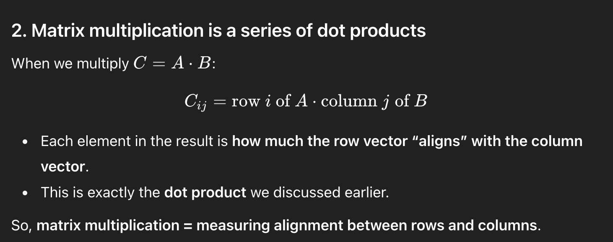

# Linear Algebra: The Language of Machine Learning

> "In mathematics you don't understand things. You just get used to them." — John von Neumann

But don't worrt we're going to understand them anyway! Let's see why linear algebra isn't just abstract math ( which is very scary trust me ) — it's just the fundamental language every machine learning algorithm speaks.

---

## Why Linear Algebra Matters: The Big Picture

Imagine you're organizing a party and need to predict how much food to buy. You have data from past parties: number of guests, duration, type of event, and food consumed. Each party is described by multiple numbers—a **vector**.

Now imagine you have data from 1,000 past parties. That's 1,000 vectors. How do you process them all efficiently? You stack them into a **matrix**.

When you train a model to predict food consumption, what's actually happening? The computer is:


1. Representing each party as a vector
2. Learning a vector of "importance weights" for each feature, which means Now the model’s job is to figure out how much each feature matters when predicting food consumption.We represent those “importances” as another vector — called the weight vector ...
3. Computing dot products between data and weights
   
4. Transforming these through matrix operations


**Every single machine learning algorithm does this.** Neural networks? Just matrix multiplications with some non-linearity. Linear regression? Matrix operations. SVMs? Kernel functions that are dot products. Even decision trees measure
feature importance using vector operations.

**Linear algebra isn't a prerequisite to check off—it's literally what ML algorithms ARE.**

---

## The Three Core Concepts (And Why Each Exists)

### 1. **Vectors: Representing Data Points**

**What it is:** A vector is an ordered list of numbers. In ML, each data point is a vector.

**Example:** A house is described by [square_feet, bedrooms, age, distance_to_city]

```
house_1 = [2000, 3, 10, 5]  ← This is a 4-dimensional vector
house_2 = [1500, 2, 2, 15]
```

**Why it matters:** When you load a CSV into memory, each row becomes a vector. When a neural network processes an image, it flattens it into a massive vector. Understanding vectors means understanding how data is represented.

**Geometric intuition:** A vector is both:

- An **arrow** from the origin to a point in space
- A **point** in n-dimensional space

In 2D, [3, 4] means "go 3 units right, 4 units up." In 100D? Same idea, just more dimensions than we can't visualize (but the math still works!).

---

### 2. **Dot Products: Measuring Similarity**

**What it is:** Multiply corresponding elements and sum them up.

```
a · b = a[0]×b[0] + a[1]×b[1] + ... + a[n]×b[n]
```

**Example:**

```
user_1_preferences = [0, 5, 3, 0, 4]  ← ratings for [action, drama, comedy, horror, scifi]
user_2_preferences = [1, 4, 3, 0, 5]

similarity = 0×1 + 5×4 + 3×3 + 0×0 + 4×5 = 0 + 20 + 9 + 0 + 20 = 49
```

Users who both love drama and scifi get a high similarity score!

**Why it matters:**

- **Similarity measurement:** High dot product = similar vectors
- **Prediction:** Linear models compute `prediction = weights · features`
- **Neural networks:** Every neuron computes a weighted dot product
- **Attention mechanisms:** Transformers use dot products to find what's relevant

**Geometric intuition:** The dot product is related to the angle between vectors:

```
a · b = |a| × |b| × cos(θ)
```

- If vectors point the same direction (θ = 0°): cos(θ) = 1 → maximum dot product
- If perpendicular (θ = 90°): cos(θ) = 0 → dot product = 0
- If opposite directions (θ = 180°): cos(θ) = -1 → negative dot product

**This is profound:** Dot products measure alignment. In ML, we're constantly asking "how much does this feature align with this pattern?"


---

### 3. **Matrix Multiplication: Transforming Data**

**What it is:** Taking two matrices and producing a third by computing many dot products.

**Example:** Say you have 3 houses (rows) and 4 features (columns). You want to apply 2 "transformations" (maybe converting to different scales). Each transformation is a set of weights.

```
Data matrix (3 houses × 4 features):
[2000, 3, 10,  5]
[1500, 2,  2, 15]
[2500, 4, 25,  3]

Weight matrix (4 features × 2 transformations):
[0.5,  -0.3]  ← weight for sqft
[0.8,   0.2]  ← weight for bedrooms
[-0.2,  0.1]  ← weight for age
[-0.4,  0.5]  ← weight for distance

Result (3 houses × 2 transformed values):
[house_1_transform_1, house_1_transform_2]
[house_2_transform_1, house_2_transform_2]
[house_3_transform_1, house_3_transform_2]
```

Each output value is the dot product of a house (row) with a transformation (column).

**Why it matters:**

- **Batch processing:** Process all data points at once (vectorization = speed!)
- **Feature transformation:** PCA, embeddings, hidden layers—all matrix multiplications
- **Composition:** Neural networks stack matrix multiplications to build complex transformations

**Geometric intuition:** Matrix multiplication is a **transformation of space**. It can:

- Rotate vectors
- Scale them
- Reflect them
- Project them to lower dimensions
- Any combination of the above!

When you do `X @ W` (data times weights), you're transforming your data from "raw feature space" to "learned feature space" where patterns are more visible.

---

## How This Appears in Real ML Algorithms

### **Linear Regression**

```python
# Prediction for all data points at once:
predictions = X @ weights + bias
```

That's it! Matrix multiplication is the entire forward pass.

### **Neural Networks**

```python
# One layer of a neural network:
hidden = activation(X @ W1 + b1)
output = activation(hidden @ W2 + b2)
```

Just stacked matrix multiplications with non-linear activations between them!

### **Principal Component Analysis (PCA)**

```python
# Project data onto principal components:
X_reduced = X @ principal_components
```

Matrix multiplication projects high-dimensional data to lower dimensions while preserving variance.

### **Recommendation Systems**

```python
# User-item predictions:
ratings_prediction = user_embeddings @ item_embeddings.T
```

Dot products everywhere to measure user-item compatibility!

---

## The Concepts We'll Implement

### **1. Vectors and Matrices (`vectors_and_matrices.py`)**

- Creating vectors and matrices
- Accessing elements (indexing)
- Basic operations (add, subtract, scalar multiply)
- Shapes and dimensions

**Why from scratch?** You'll see there's no magic—just lists and loops. When NumPy does this in C, it's the same logic, just optimized.

### **2. Dot Products (`dot_products.py`)**

- Computing dot products
- Understanding geometric meaning
- Measuring vector length (norm)
- Computing angles between vectors

**Why from scratch?** The formula `sum(a[i] * b[i])` hides deep geometric meaning. By implementing it, you'll internalize what "alignment" means.

### **3. Matrix Multiplication (`matrix_multiplication.py`)**

- Standard matrix multiplication
- Understanding dimensions (when can you multiply?)
- Computational complexity (why O(n³) matters)

**Why from scratch?** Matrix multiplication isn't commutative (`A @ B ≠ B @ A`). By implementing it, you'll understand why order matters in neural networks.





### **4. Eigendecomposition (`eigen_decomposition.py`)**

- Finding eigenvalues and eigenvectors
- Understanding principal directions
- Geometric meaning: directions that stay the same (just scaled)

**Why it matters:** PCA is just eigendecomposition of the covariance matrix. Once you understand eigenvectors, PCA becomes obvious.

---

## Common Confusions (And How to Think About Them)

### **"Why do we multiply matrices this weird way?"**

Matrix multiplication seems arbitrary—why not just element-wise multiplication? Because we want to compose transformations! If matrix A rotates space and matrix B scales it, then `A @ B` does both. The "weird" rule is actually the natural way to chain transformations.

### **"What does it mean for vectors to be perpendicular?"**

Two vectors are perpendicular (orthogonal) if their dot product is zero. Geometrically, this means they point in completely different directions—there's no overlap. In ML, orthogonal features are independent (knowing one tells you nothing about the other).

### **"Why are dimensions confusing?"**

In matrix multiplication `A @ B`, the shapes must match: `(m × n) @ (n × p) = (m × p)`. The inner dimensions must match (n = n), and the result has the outer dimensions. Think of it as: "rows of A" paired with "columns of B."

### **"What's the difference between vectors and matrices?"**

A vector is 1D (a list of numbers). A matrix is 2D (a table of numbers). But actually, a vector can be thought of as a matrix with one column (column vector) or one row (row vector). It's all about perspective!

---

## Connection to What Comes Next

**Statistics:** Now that you know how to represent data (vectors), you need to understand it (mean, variance). Covariance is just a matrix of dot products between features!

**Loss Functions:** To train a model, you compute predictions with matrix ops, then measure error with a loss function.

**Gradient Descent:** The gradient is a vector! It tells you which direction in weight space decreases the loss. We update weights using vector subtraction.

**Everything Else:** Neural nets, SVMs, PCA, clustering—all built on these linear algebra primitives.

---

## The Aha Moment You're Heading Toward

After implementing these operations, you'll have a profound realization: **Machine learning is mostly just matrix multiplication.**

Neural networks? Stack matrices. Transformers? Matrices with fancy attention. Recommender systems? Matrix factorization. Even complicated algorithms are built from these simple operations.

Once you've implemented them yourself, libraries like NumPy and PyTorch won't feel like magic. You'll know exactly what `@` does. You'll understand why GPUs are fast (they're optimized for matrix ops). You'll debug confidently because you know what's happening beneath the abstraction.

This is the foundation. Master it, and everything else becomes combinations of things you deeply understand.

---

Let's implement it now ! 🚀
