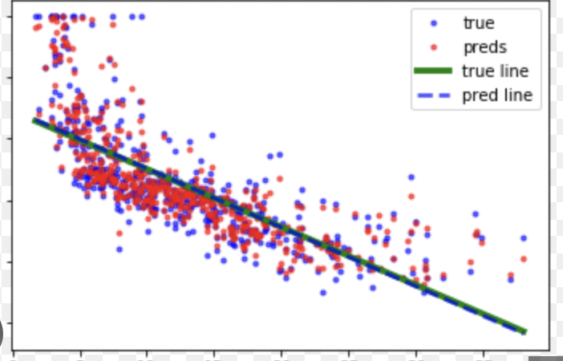
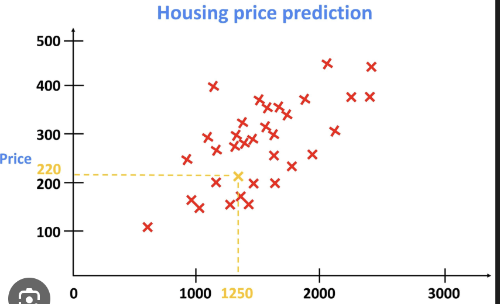

# Linear Regression: Where My ML Journey Really Began

> "It's just finding the best line through points, right? ...Oh wait, it's SO much deeper than that." — Me

---

## What This Folder Contains

This is where I implemented my first real machine learning algorithm! Linear regression is beautifully simple on the surface: find the line (or hyperplane) that best fits your data. But implementing it from scratch taught me that "best fit" has profound mathematical meaning.

I built three different implementations here ( based on how I learned it from Campus-X), each teaching me something different:

1. **`linear_regression_scratch.py`**: The full gradient descent version where I watch the model learn step by step
2. **`linear_regression_closed_form.py`**: The "cheat code" using the Normal Equation (instant solution!)
3. **`polynomial_features.py`**: How to make linear models fit curves (mind = blown)
4. **`visualizations.py`**: See what's actually happening during training

## What Problem Does Linear Regression Solve?

**The setup:** You have data points (X, y) and you want to predict y from X.



**Examples:**

- Predict house prices from square footage, bedrooms, and age
- Predict a student's test score from hours studied and hours slept
- Predict tomorrow's temperature from today's weather features



**The mathematical goal:** Find weights w such that predictions ŷ = Xw are as close as possible to true values y.

But what does "as close as possible" mean? That's where the loss function comes in! We use Mean Squared Error (MSE), which penalizes large errors heavily:

```
Loss = (1/n) Σ(ŷᵢ - yᵢ)²
```

Squaring the errors does two things:

1. Makes all errors positive (so they don't cancel out)
2. Punishes large errors much more than small errors (10² = 100, but 1² = 1)

## The Two Approaches: Iterative vs. Closed-Form

When I started, I didn't realize there were two completely different ways to solve linear regression!

### Approach 1: Gradient Descent (Iterative)

This is the "learning" approach. Start with random weights, compute the gradient (direction of steepest increase in loss), then move in the opposite direction (downhill). Repeat until you reach the minimum.

**Pros:**

- Works for any dataset size (scales to millions of samples)
- Teaches you how optimization actually works
- Foundation for neural networks (no closed-form for those!)
- Can use different optimizers (Batch, SGD, Mini-Batch)

**Cons:**

- Need to choose learning rate (too big = divergence, too small = slow)
- Need to choose number of epochs (when to stop?)
- Slower than closed-form for small datasets

**When I use it:** Almost always! It's more flexible and teaches better intuition.

### Approach 2: Normal Equation (Closed-Form)

This is the mathematical "cheat code." There's a direct formula that computes the optimal weights in one shot:

```
w = (XᵀX)⁻¹Xᵀy
```

**Pros:**

- No hyperparameters (no learning rate, no epochs)
- Instant solution (one matrix calculation)
- Guaranteed to find the optimal weights (if solution exists)

**Cons:**

- Requires computing (XᵀX)⁻¹ — EXPENSIVE for large matrices! (O(n³) complexity)
- Fails if XᵀX is not invertible (e.g., when features are perfectly correlated)
- Only works for linear regression (no closed-form for logistic, neural nets, etc.)
- Doesn't scale to millions of samples (matrix inversion breaks down)

**When I use it:** Mostly for small datasets or when I need the exact solution for comparison.

## What I Learned Building This

### Initially, I Was Confused About...

**1. "Why do we need a bias term?"**

At first, I thought `y = w₁x₁ + w₂x₂` was enough. But this forces the line to pass through the origin (0,0)! Adding a bias `w₀` allows the line to shift up or down:

```
y = w₀ + w₁x₁ + w₂x₂
```

In practice, we just add a column of ones to X:

```
X = [[1, x₁₁, x₁₂],
     [1, x₂₁, x₂₂],
     [1, x₃₁, x₃₂]]
```

Now the first weight `w₀` naturally becomes the bias! This trick is used everywhere in ML.

**2. "What does 'linear' actually mean?"**

I thought "linear model" meant it can only fit straight lines. WRONG!

Linear means **linear in the weights**, not linear in the features. So this is still a linear model:

```
y = w₀ + w₁x + w₂x² + w₃x³ + w₄sin(x)
```

As long as you're computing `y = w · features`, it's linear! The features themselves can be anything. This is why polynomial regression (fitting curves) is still called "linear" regression.

**3. "Why does the gradient look the way it does?"**

I derived this myself to understand it. Starting with MSE loss:

$$
J(\mathbf{w}) = \frac{1}{n} \sum_{i=1}^n (\hat{y}_i - y_i)^2
              = \frac{1}{n} \sum_{i=1}^n (\mathbf{w}^\top \mathbf{x}_i - y_i)^2
$$

Taking the derivative with respect to w:

$$
\frac{\partial J}{\partial \mathbf{w}}
= \frac{2}{n} \sum_{i=1}^n (\mathbf{w}^\top \mathbf{x}_i - y_i)\,\mathbf{x}_i
= \frac{2}{n} \mathbf{X}^\top(\mathbf{X}\mathbf{w} - \mathbf{y})
$$

(We usually drop the 2 and absorb it into the learning rate)

This gradient has a beautiful interpretation: It's the correlation between features X and errors (ŷ - y). If a feature strongly correlates with the error, its weight needs to change more!

### Things That Finally Clicked When I Implemented Them...

**1. Gradient descent is just following the slope downhill**

I made a 1D visualization where I plotted the loss as a function of one weight. Gradient descent literally just walks down the curve! In high dimensions, it's the same idea, just harder to visualize.

**2. The learning rate controls step size, not speed**

I used to think "bigger learning rate = faster convergence." Sometimes true, but a learning rate that's too large will cause the optimizer to overshoot the minimum and diverge! It's like trying to walk down a hill — small steps are slow but safe, large steps are fast but you might tumble.

The best learning rate is the largest value that still converges. Finding it requires experimentation (or learning rate schedules).

**3. Polynomial features transform the problem**

This was MIND-BLOWING. To fit a parabola `y = ax² + bx + c`, you don't need a new algorithm! Just transform your features:

```
Original: x → [[x₁], [x₂], [x₃]]
Transformed: x → [[1, x₁, x₁²], [1, x₂, x₂²], [1, x₃, x₃²]]
```

Now run regular linear regression! The model learns weights [c, b, a] and automatically fits a parabola. This trick generalizes to any feature transformation.

**4. The Normal Equation is just calculus**

The closed-form solution isn't magic. It comes from setting the gradient to zero:

$$
\nabla_{\mathbf{w}} J(\mathbf{w})
= \frac{2}{n}\mathbf{X}^\top(\mathbf{X}\mathbf{w} - \mathbf{y}) = 0
$$

Setting the gradient to zero:

$$
\mathbf{X}^\top(\mathbf{X}\mathbf{w} - \mathbf{y}) = 0
$$

Expand:

$$
\mathbf{X}^\top \mathbf{X}\,\mathbf{w}
= \mathbf{X}^\top \mathbf{y}
$$

Solve for **w**:

$$
\mathbf{w} = (\mathbf{X}^\top \mathbf{X})^{-1}\mathbf{X}^\top \mathbf{y}
$$

It's just solving for where the derivative equals zero (the minimum of the parabola)! But computing (XᵀX)⁻¹ is expensive, which is why we often use gradient descent instead.

## Files in This Folder

### `linear_regression_scratch.py`

The main implementation using gradient descent. This is where most of the learning happens!

**What it does:**

- Implements `LinearRegression` class with `fit()` and `predict()` methods
- Uses any optimizer from `foundations/gradient_descent/` (Batch, SGD, Mini-Batch)
- Uses MSE loss from `foundations/loss_functions/`
- Tracks training history (loss over epochs)
- Includes detailed comments explaining every step

**Key features:**

- Flexible optimizer selection (compare Batch vs. SGD vs. Mini-Batch)
- Learning rate and epoch configuration
- Verbose mode to watch training progress
- Prediction with confidence (returns predicted values)

**When I use it:** This is my default. It works for any dataset size and teaches me about optimization.

### `linear_regression_closed_form.py`

The "instant solution" using the Normal Equation.

**What it does:**

- Implements `LinearRegressionClosedForm` class
- Computes w = (XᵀX)⁻¹Xᵀy directly
- No training loop, no hyperparameters
- Includes checks for matrix invertibility

**Key features:**

- Instant solution (no iterative training)
- Exact optimal weights (not approximate)
- Useful for comparing against gradient descent

**When I use it:** Small datasets where I want the exact solution, or to verify my gradient descent implementation is correct.

**Gotchas I discovered:**

- If XᵀX is not invertible (singular), this fails! Happens when:
  - Features are perfectly correlated (e.g., x₂ = 2x₁)
  - More features than samples (underdetermined system)
  - Features have no variance (all the same value)
- Matrix inversion is numerically unstable for large or ill-conditioned matrices

### `polynomial_features.py`

Feature engineering tool to make linear models fit non-linear patterns.

**What it does:**

- Takes input features X and generates polynomial combinations
- For degree=2: [x] → [1, x, x²]
- For degree=3: [x₁, x₂] → [1, x₁, x₂, x₁², x₁x₂, x₂², x₁³, x₁²x₂, x₁x₂², x₂³]
- Implements `fit_transform()` method for scikit-learn compatibility

**Key insight:** This is how you fit curves with linear regression!

**Example use case:**

```python
# Original data: points along a parabola
X = Matrix([[1], [2], [3], [4]])
y = Matrix([[1], [4], [9], [16]])  # y = x²

# Transform to polynomial features
poly = PolynomialFeatures(degree=2)
X_poly = poly.fit_transform(X)  # Now includes [1, x, x²]

# Fit linear regression on transformed features
model = LinearRegression()
model.fit(X_poly, y)  # Learns to fit the parabola!
```

**Warning:** High degrees can cause overfitting! With degree=10, you can fit any 11 points perfectly, but the curve will be crazy between points.

### `visualizations.py`

Seeing is believing! This file creates plots to understand what's happening.

**What it visualizes:**

1. **2D regression line**: Plot data points and the fitted line
2. **Loss convergence**: Watch loss decrease over epochs
3. **Polynomial fitting**: See how different degrees fit the data
4. **Gradient descent path**: Visualize how weights evolve during training
5. **Learning rate comparison**: Show effect of different learning rates

**Why this matters:** I didn't truly understand gradient descent until I watched it in action. Seeing the loss curve smooth out and the line fit the data made everything click.

**Example output:**

```
Epoch   0: Loss = 1250.4523
Epoch  10: Loss = 234.8921
Epoch  20: Loss = 56.2341
Epoch  30: Loss = 12.9876
Epoch  40: Loss = 3.2109
Epoch  50: Loss = 0.8234  ← converging!
```

## How to Use These Files

### Basic Linear Regression

```python
from foundations.linear_algebra.vectors_and_matrices import Matrix
from linear_regression_scratch import LinearRegression

# Create training data (house prices example)
X_train = Matrix([
    [1, 1500, 3],  # bias, sqft, bedrooms
    [1, 1800, 4],
    [1, 2400, 3],
    [1, 3000, 4]
])
y_train = Matrix([[300000], [340000], [369000], [450000]])

# Train the model
model = LinearRegression(learning_rate=0.01, n_epochs=100, verbose=True)
model.fit(X_train, y_train)

# Make predictions
X_test = Matrix([[1, 2000, 3]])
predicted_price = model.predict(X_test)
print(f"Predicted price: ${predicted_price[0, 0]:,.2f}")
```

### Comparing Iterative vs. Closed-Form

```python
from linear_regression_scratch import LinearRegression
from linear_regression_closed_form import LinearRegressionClosedForm

# Train with gradient descent
model_gd = LinearRegression(learning_rate=0.01, n_epochs=200)
model_gd.fit(X_train, y_train)

# Train with Normal Equation
model_cf = LinearRegressionClosedForm()
model_cf.fit(X_train, y_train)

# Compare weights
print("Gradient Descent weights:", model_gd.weights_.elements)
print("Closed-Form weights:", model_cf.weights_.elements)
# Should be very close!
```

### Polynomial Regression

```python
from polynomial_features import PolynomialFeatures
from linear_regression_scratch import LinearRegression

# Original features (just x)
X = Matrix([[1], [2], [3], [4], [5]])
y = Matrix([[1], [4], [9], [16], [25]])  # y = x²

# Transform to polynomial features
poly = PolynomialFeatures(degree=2)
X_poly = poly.fit_transform(X)  # Adds x² term

# Fit polynomial regression
model = LinearRegression(learning_rate=0.01, n_epochs=500)
model.fit(X_poly, y)

# Predict on new points
X_new = Matrix([[6], [7]])
X_new_poly = poly.transform(X_new)
predictions = model.predict(X_new_poly)
print(predictions)  # Should be close to [36, 49]
```

### Running Visualizations

```python
# Just run the visualization script
python visualizations.py

# It will show:
# 1. Simple 2D regression fit
# 2. Loss curves for different learning rates
# 3. Polynomial regression with different degrees
# 4. Comparison of optimizers (Batch, SGD, Mini-Batch)
```

## What Each File Teaches

| File                               | Key Lesson                                                                        |
| ---------------------------------- | --------------------------------------------------------------------------------- |
| `linear_regression_scratch.py`     | How gradient descent actually works. The learning loop. Choosing hyperparameters. |
| `linear_regression_closed_form.py` | There's sometimes a direct solution. When it works and when it fails.             |
| `polynomial_features.py`           | Linear models can fit non-linear patterns through feature engineering.            |
| `visualizations.py`                | Seeing how loss decreases and lines fit data builds intuition.                    |

## Common Mistakes I Made (And Fixed)

### Mistake 1: Forgetting to Add Bias Column

My first implementation:

```python
model.fit(X, y)  # X doesn't have bias column!
```

The model tried to fit a line through the origin and failed miserably. Solution: Always add a column of ones to X:

```python
X_with_bias = add_bias_column(X)
model.fit(X_with_bias, y)
```

### Mistake 2: Learning Rate Too Large

I set learning_rate=1.0 and watched my loss INCREASE instead of decrease! The steps were so large that I kept overshooting the minimum. I learned to start with small values (0.01 or 0.001) and increase if convergence is too slow.

### Mistake 3: Not Normalizing Features

When features have very different scales (e.g., square footage in thousands, number of bedrooms in single digits), gradient descent struggles. Some dimensions have steep gradients, others have shallow gradients, causing a zigzagging path.

Solution: Feature scaling! Normalize features to have similar ranges:

```python
# Standardization: (x - mean) / std
# Now all features have mean=0, std=1
```

I added standardization to `foundations/data_preprocessing/` because every model needs it.

### Mistake 4: Using Wrong Matrix Dimensions

Spent HOURS debugging dimension mismatches! Here's what I learned:

```
X: (n_samples, n_features)  → e.g., (100, 3) for 100 houses, 3 features
y: (n_samples, 1)           → e.g., (100, 1) for 100 house prices
w: (n_features, 1)          → e.g., (3, 1) for 3 weights

Predictions: ŷ = X @ w
(100, 3) @ (3, 1) = (100, 1) ✓

Gradient: ∇ = (1/n) Xᵀ(ŷ - y)
(3, 100) @ (100, 1) = (3, 1) ✓
```

If dimensions don't match, something's wrong!

---
